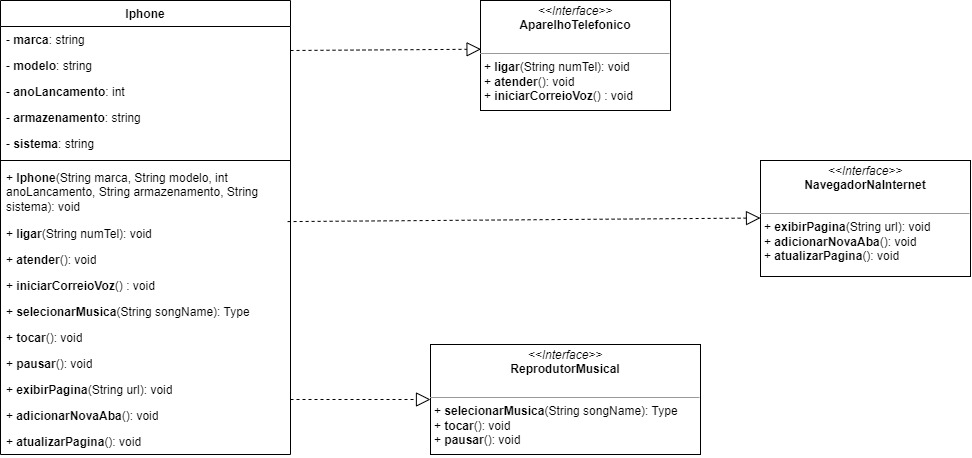

# Desafio POO e UML - Componente iPhone

O desafio consiste no desenvolvimento da Modelagem e diagramação da representação em UML e Código no que se refere ao componente iPhone.

## Componentes esperados

* **Repodutor Musicial**: tocar, pausar, selecionarMusica
* **Aparelho Telefônico**: ligar, atender, iniciarCorrerioVoz
* **Navegador na Internet**: exibirPagina, adicionarNovaAba, atualizarPagina


## Resultados obtidos

### Diagrama de classe


### Interfaces

1. **Aparelho Telefônico**: ligar, atender, iniciarCorrerioVoz

```java
package edu.giovanesouza.iphone;

public interface AparelhoTelefonico {

    // Métodos a serem implementados
    void ligar(String numTel);
    void atender();
    void iniciarCorreioVoz();
    
}

```

2. **Repodutor Musicial**: tocar, pausar, selecionarMusica

```java
package edu.giovanesouza.iphone;

public interface ReprodutorMusical {

    // Métodos a serem implementados
    void selecionarMusica(String songName);
    void tocar();
    void pausar();

}
```

3. **Navegador na Internet**: exibirPagina, adicionarNovaAba, atualizarPagina

```java
package edu.giovanesouza.iphone;

public interface NavegadorNaInternet {

    // Métodos a serem implementados
    void exibirPagina(String url);
    void adicionarNovaAba();
    void atualizarPagina();

}

```


4. **Classe Iphone** (modelo) com as implementações

```java
package edu.giovanesouza.iphone;

public class Iphone implements AparelhoTelefonico, ReprodutorMusical, NavegadorNaInternet {

    // Atributos
    private String marca;
    private String modelo;
    private int anoLancamento;

    private String armazenamento;
    private String sistema;


    // Construtor
    public Iphone(String marca, String modelo, int anoLancamento, String armazenamento, String sistema) {
        this.marca = marca;
        this.modelo = modelo;
        this.anoLancamento = anoLancamento;
        this.armazenamento = armazenamento;
        this.sistema = sistema;
    }


    // Funcionalidades AparelhoTelefonico
    // Método para ligar -> Só realiza a ligação caso digite um número com pelo menos 9 digitos
    boolean calling = false;

    @Override
    public void ligar(String numTel) {
        if (!numTel.isEmpty() && numTel.length() >= 9) {
            this.calling = true;
            System.out.println("✅ Número discado: " + numTel + " | ✆ Ligando...");
        } else
            System.out.println("❌ Informe um número válido para realizar a ligação");
    }


    @Override
    public void atender() {
        if(!calling)
            System.out.println("✅ Ligação atendida.");
        else
            System.out.println("⚠️ Você já está em uma chamada. Finalize-a para atender outra ligação.");
    }

    @Override
    public void iniciarCorreioVoz() {
        // Se estiver ligando e chamar este método -> permite gravar mensagem
        if (calling) {
            System.out.println("##### Bem vindo ao correio de voz. #####");
            System.out.println("# Após o sinal, deixe o seu recado...");
            System.out.println("\uD83D\uDD0A piiii.");

            for (int i = 0; i < 5; i++) {
                System.out.println("⏺︎ Gravando recado...");
            }

            System.out.println("✅ Recado enviado com sucesso!");
        } else
            System.out.println("⚠️ Para iniciar o correio de voz é necessário discar um número.");
    }


    // Funcionalidades NavegadorNaInternet
    @Override
    public void exibirPagina(String url) {
        if (!url.isEmpty())
            System.out.println("✅ Acessando o site: " + url);
        else
            System.out.println("❌ Informe uma url válida.");
    }

    @Override
    public void adicionarNovaAba() {
        System.out.println("✅ Nova aba adicionada com sucesso!");
    }

    @Override
    public void atualizarPagina() {
        System.out.println("✅ Página atualizada com sucesso!");
    }


    // Funcionalidades ReprodutorMusical
    boolean isSelectedSong = false;
    String song = "";

    @Override
    public void selecionarMusica(String songName) {
        if (!songName.isEmpty()) {
            this.isSelectedSong = true;
            this.song = songName;

            System.out.println("✅ Música selecionada: " + songName);
        } else
            System.out.println("❌ Selecione uma música.");

    }

    boolean isPlayingSong = false;

    @Override
    public void tocar() {
        if (isSelectedSong) {
            this.isPlayingSong = true;
            System.out.println("⏵︎ Tocando a música: " + song);
        } else
            selecionarMusica("");

    }

    @Override
    public void pausar() {

        if (isPlayingSong) {
            this.isPlayingSong = false;
            System.out.println("⏸︎ A Música " + song + " foi pausada.");
        }

    }


    @Override
    public String toString() {
        return "Informações iPhone = " + "\n"
                + "- Marca: " + marca + "\n"
                + "- Modelo: " + modelo + "\n"
                + "- Ano de Lancamento: " + anoLancamento + "\n"
                + "- Armazenamento: " + armazenamento + "\n"
                + "- Sistema: " + sistema + "\n";
    }

}

```

5. **Classe TestaIphone**: Classe responsável pelo instanciamente e teste dos métodos

```java
package edu.giovanesouza;

import edu.giovanesouza.iphone.Iphone;

public class TestaIphone {

    public static void main(String[] args) {

        Iphone iphone = new Iphone("Apple",
                "iphone 8 Plus",
                2017, "256 GB", "iOS");

        // System.out.println(iphone); // Imprime os dados do iphone criado

        // Métodos AparelhoTelefonico
        //iphone.ligar("988888888");
        //iphone.atender();
        //iphone.iniciarCorreioVoz();

        // Métodos NavagadorNaInternet
        //iphone.exibirPagina("https://github.com/giovanesouza");
        //iphone.adicionarNovaAba();
        //iphone.atualizarPagina();

        // Métodos ReprodutorMusical
        //iphone.selecionarMusica("O rei está voltando");
        //iphone.tocar();
        //iphone.pausar();
        //iphone.tocar();

    }

}
```
